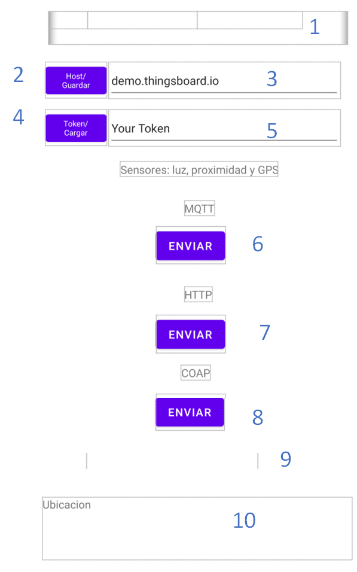

# App_Android
 Aplicación de Android que permite sensar luminosidad, proximidad y valores de GPS. Los datos anteriores se envían a la página de Thingsboard en su versión demo para realizar pruebas.
La aplicación se la ha realizado en Android Studio 4.1.2. Para poner en contexto en la realización de la aplicación se utilizaron varias librerías compatibles con Java como “Eclipse Paho Java Client” que permite usar el protocolo Mqtt, la librería “Eclipse Californium” que permite usar el protocolo Coap y la librería “HttpURLConnection” para usar el protocolo Http. Además, los ejemplos de conexión en muchos de los casos los da la librería para editar y hacer la información compatible con el formato de texto Json que es el que utiliza ThingsBoard.

       Figura 1: Interfaz gráfica de la aplicación de Android.

Solo se presenta la parte gráfica en la Figura 1 de la misma ya que el código es bastante extenso. Desde el número 1 es para visualizar que se han enviado los datos por Coap. El número 2 es el servidor al cual se dirigirá la información en este caso es “demo.thingsboard.io” ya que la plataforma ThingsBoard también cuenta con una versión Cloud y una versión que es para instalación local. El número 3 es el Token del dispositivo hacia el cual en “demo.thingsboard.io” se enviará la información y también cuenta como el usuario. El número 4 es el botón para enviar los datos por Mqtt. El número 5 es el botón para enviar los datos por Http. El número 6 es el botón para enviar los datos por Coap. El número 7 es un visualizador para la luminosidad y para proximidad. El número 8 es un visualizador para la latitud y longitud que se obtienen del GPS.

       Figura 2: Visualización de datos en Thingsboard.
En la Figura 2 se muestra el resultado de los sensores tanto de la posición de mapa que nos brinda el GPS, los valores de luminosidad de 0 a 2000 lux y para la proximidad dará un 0 si esta lejos y un 1 si esta cerca.

